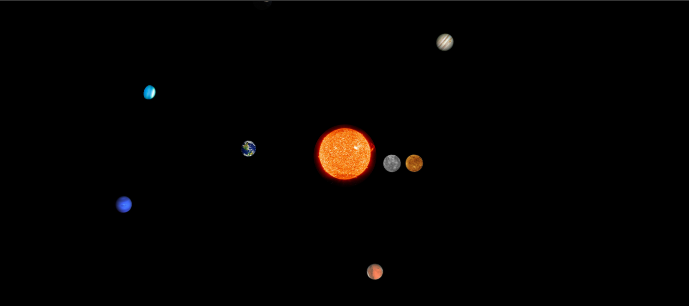

# SISTEMA SOLAR
😏USE ESSE CÓDIGO EM HTML E CSS PARA VER OS PLANETAS ORBITANDO O SOL.

 
  

  
> OS PLANETAS SE MOVEM AO REDOR DO SOL NO SENTIDO HORÁRIO!

## ☺DESCRIÇÃO:
Bem-vindo ao projeto "Sistema Solar"! Este repositório contém uma implementação interativa de um modelo do sistema solar em HTML, CSS e JavaScript. O projeto permite explorar e aprender sobre os planetas do nosso sistema solar.

### 👽Funcionalidades:
O objetivo deste projeto é oferecer uma representação visual e interativa do sistema solar. Aqui estão as principais funcionalidades implementadas:
- **Modelo em 2D**: O projeto exibe um modelo interativo do sistema solar, mostrando os planetas em suas órbitas ao redor do sol.
- **Visualização realista**: Cada planeta é representado por uma imagem realista correspondente, capturando a aparência distinta de cada um deles.
- **Movimento orbital**: Os planetas se movem em suas órbitas, obedecendo às suas velocidades e distâncias reais em relação ao sol.
- **Interatividade**: Os usuários podem pausar e retomar a animação do modelo, permitindo explorar detalhes dos planetas individualmente.
- **Informações adicionais**: O modelo não só oferece uma visualização impressionante do sistema solar, mas também fornece informações básicas sobre cada planeta.

### 🤗Como usar o Projeto Sistema Solar?
Para explorar o projeto do sistema solar em seu navegador, siga estas etapas simples:
1. Clone este repositório em sua máquina local ou faça o download dos arquivos.
2. Abra o arquivo `SISTEMA.html` em seu navegador de preferência.
3. O modelo do sistema solar será carregado em seu navegador.
4. Observe os planetas movendo-se em suas órbitas ao redor do sol.
5. Passe o mouse sobre um planeta para ver informações básicas sobre ele.
6. Clique no botão de pausa para interromper a animação e examinar os planetas em detalhes.
